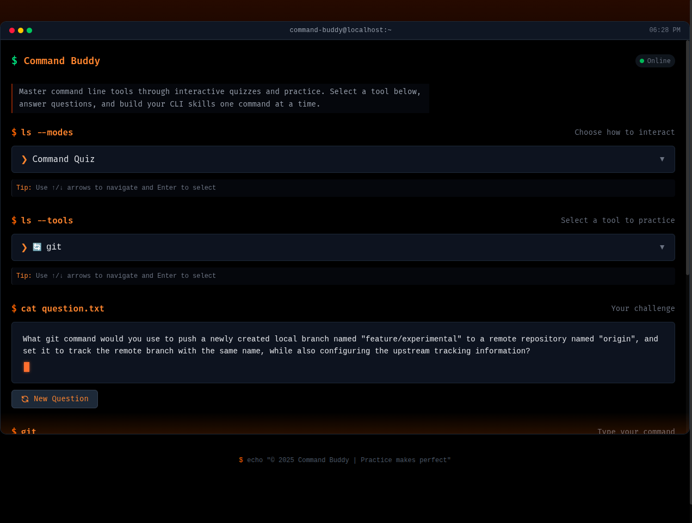
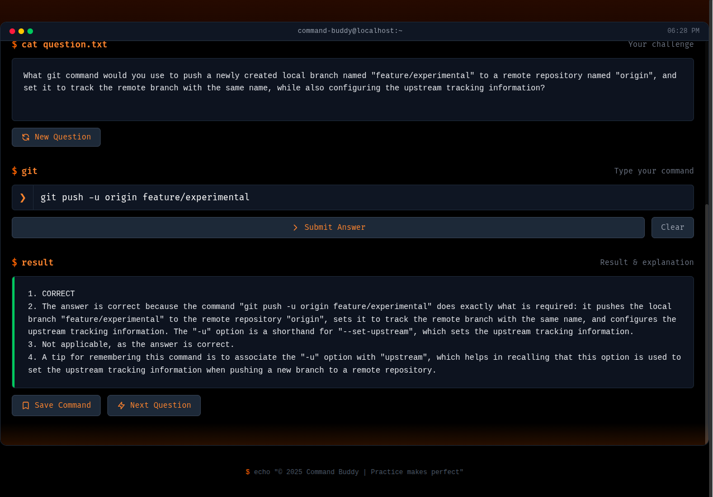

# Command Buddy

Command Buddy is a simple application that helps users memorize commands for various tools like Docker, Kubernetes, Git, etc. through interactive quizzes.



## Features

- Generate quiz questions for specific tools (Docker, Kubernetes, Git, etc.)
- Evaluate user answers with feedback
- Get detailed explanations for commands
- Save commands for later reference

## Setup

### Prerequisites

- Java 17+
- MongoDB
- Groq API key

### Environment Variables

Create a `.env` file in the root directory with:

```
GROQ_API_KEY=your_groq_api_key_here
MONGODB_URI=mongodb://localhost:27017/commandbuddy
```

### Running the Application

```bash
cd app/buddy
./mvnw spring-boot:run
```

## API Endpoints

### Quiz Endpoints

- `GET /api/quiz/{toolName}` - Generate a quiz question for a specific tool
- `POST /api/quiz/check` - Check if an answer is correct
- `POST /api/quiz/explain` - Get an explanation for a command
- `POST /api/quiz/save` - Save a command for later reference

### Command Endpoints

- `POST /commands` - Create a new command
- `GET /commands/{toolName}` - Get all commands for a specific tool
- `GET /commands/{toolName}/search?searchText=xyz` - Search for commands by text

## Example Usage

### Generate a Quiz Question

```bash
curl -X GET http://localhost:8080/api/quiz/git
```

### Check an Answer

```bash
curl -X POST http://localhost:8080/api/quiz/check \
  -H "Content-Type: application/json" \
  -d '{
    "toolName": "git",
    "question": "How do you stage all changed files in the current directory?",
    "answer": "git add ."
  }'
```

### Save a Command

```bash
curl -X POST http://localhost:8080/api/quiz/save \
  -H "Content-Type: application/json" \
  -d '{
    "toolName": "git",
    "command": "git add .",
    "explanation": "This command stages all changed files in the current directory for the next commit."
  }'
```
